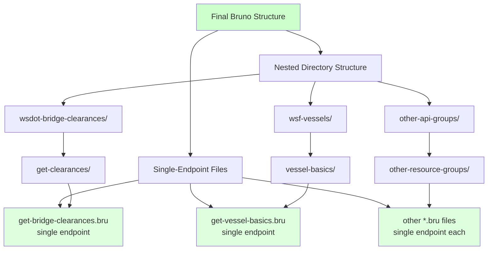

# Bruno API Refactoring Consolidated Plan

## Document Overview
This document consolidates all information related to the Bruno API refactoring project, including the plan, implementation details, structure summary, and visual diagrams. This serves as the single source of truth for the project.

## Objective
Create a new Bruno API collection structure from scratch, creating individual endpoint files organized in subfolders. The goal is to have 98 individual `.bru` files organized in subfolders, where each API group becomes a subfolder containing individual endpoint files. The new structure will be built according to the target structure.

## Approach
This is a clean implementation approach where:
1. The new structure will be built from scratch based on the API endpoint specifications
2. Each API endpoint will be implemented as a separate `.bru` file following the target format specification

## Final Structure (Target Structure)

### Final Structure
```
bruno/
├── bruno.json
├── README.md
├── environments/
│   └── ws-dottie-env.bru
├── wsdot-border-crossings/
│   └── border-crossing-data/
│       └── get-border-crossings.bru
├── wsdot-bridge-clearances/
│   └── get-clearances/
│       ├── get-bridge-clearances.bru
│       └── get-bridge-clearances-by-route.bru
├── wsdot-commercial-vehicle-restrictions/
│   ├── cv-restriction-data-with-id/
│   │   └── get-cv-restriction-data-with-id.bru
│   └── cv-restriction-data/
│       ├── get-commercial-vehicle-restrictions.bru
│       └── get-commercial-vehicle-restrictions-with-id.bru
├── wsdot-highway-alerts/
│   ├── alerts/
│   │   ├── get-alerts.bru
│   │   ├── get-alert-by-id.bru
│   │   ├── get-alerts-by-region-id.bru
│   │   ├── get-alerts-by-map-area.bru
│   │   └── search-alerts.bru
│   ├── areas/
│   │   └── get-map-areas.bru
│   └── event-categories/
│       └── get-event-categories.bru
├── wsdot-highway-cameras/
│   └── cameras/
│       ├── get-highway-cameras.bru
│       ├── search-highway-cameras-by-route-and-milepost.bru
│       └── get-highway-camera-by-camera-id.bru
├── wsdot-mountain-pass-conditions/
│   └── pass-conditions/
│       ├── get-mountain-pass-condition-by-id.bru
│       └── get-mountain-pass-conditions.bru
├── wsdot-toll-rates/
│   ├── toll-rates/
│   │   └── get-toll-rates.bru
│   ├── toll-trip-info/
│   │   └── get-toll-trip-info.bru
│   ├── toll-trip-rates/
│   │   ├── get-toll-trip-rates.bru
│   │   ├── get-trip-rates-by-date.bru
│   │   └── get-trip-rates-by-version.bru
│   └── toll-trip-version/
│       └── get-toll-trip-version.bru
├── wsdot-traffic-flow/
│   └── traffic-flow/
│       ├── get-traffic-flows.bru
│       └── get-traffic-flow-by-id.bru
├── wsdot-travel-times/
│   └── travel-time-routes/
│       ├── get-travel-time-by-id.bru
│       └── get-travel-times.bru
├── wsdot-weather-information/
│   └── weather-info/
│       ├── get-weather-information.bru
│       ├── get-weather-information-by-station-id.bru
│       ├── get-current-weather-for-stations.bru
│       └── search-weather-information.bru
├── wsdot-weather-readings/
│   ├── sub-surface-measurements/
│   │   └── get-sub-surface-measurements.bru
│   ├── surface-measurements/
│   │   └── get-surface-measurements.bru
│   └── weather-readings/
│       └── get-weather-readings.bru
├── wsdot-weather-stations/
│   └── weather-stations/
│       └── get-weather-stations.bru
├── wsf-fares/
│   ├── cache-flush-date/
│   │   └── get-cache-flush-date.bru
│   ├── fare-line-items/
│   │   ├── get-fare-line-items-by-trip-date-and-terminals.bru
│   │   ├── get-fare-line-items-basic.bru
│   │   └── get-fare-line-items-verbose.bru
│   ├── fare-totals/
│   │   └── get-fare-totals-by-trip-date-and-route.bru
│   ├── terminal-combo/
│   │   ├── get-terminal-combo.bru
│   │   └── get-terminal-combo-verbose.bru
│   ├── terminals/
│   │   └── get-fares-terminals.bru
│   └── valid-date-range/
│       └── get-fares-valid-date-range.bru
├── wsf-schedule/
│   ├── active-seasons/
│   │   └── get-active-seasons.bru
│   ├── cache-flush-date/
│   │   └── get-cache-flush-date.bru
│   ├── route-details/
│   │   ├── get-route-details-by-trip-date.bru
│   │   ├── get-route-details-by-trip-date-and-route-id.bru
│   │   └── get-route-details-by-trip-date-and-terminals.bru
│   ├── routes/
│   │   ├── get-routes-by-trip-date.bru
│   │   └── get-routes-by-trip-date-and-terminals.bru
│   ├── sailings/
│   │   ├── get-all-sailings-by-sched-route-id.bru
│   │   └── get-sailings-by-route-id.bru
│   ├── schedule-alerts/
│   │   └── get-schedule-alerts.bru
│   ├── schedule-today/
│   │   ├── get-schedule-today-by-route.bru
│   │   └── get-schedule-today-by-terminals.bru
│   ├── scheduled-routes/
│   │   ├── get-scheduled-routes.bru
│   │   └── get-scheduled-routes-by-id.bru
│   ├── schedules/
│   │   ├── get-schedule-by-trip-date-and-route-id.bru
│   │   └── get-schedule-by-trip-date-and-departing-terminal-id-and-terminal-ids.bru
│   ├── service-disruptions/
│   │   └── get-routes-having-service-disruptions-by-trip-date.bru
│   ├── terminal-mates/
│   │   └── get-terminal-mates.bru
│   ├── terminals/
│   │   ├── get-terminals.bru
│   │   ├── get-terminals-and-mates.bru
│   │   └── get-terminals-and-mates-by-route.bru
│   ├── time-adjustments/
│   │   ├── get-time-adjustments.bru
│   │   ├── get-time-adjustments-by-route.bru
│   │   └── get-time-adjustments-by-sched-route.bru
│   └── valid-date-range/
│       └── get-schedule-valid-date-range.bru
├── wsf-terminals/
│   ├── cache-flush-date/
│   │   └── get-cache-flush-date.bru
│   ├── terminal-basics/
│   │   ├── get-terminal-basics.bru
│   │   └── get-terminal-basics-by-terminal-id.bru
│   ├── terminal-bulletins/
│   │   ├── get-terminal-bulletins.bru
│   │   └── get-terminal-bulletins-by-terminal-id.bru
│   ├── terminal-locations/
│   │   ├── get-terminal-locations.bru
│   │   └── get-terminal-locations-by-terminal-id.bru
│   ├── terminal-sailing-space/
│   │   ├── get-terminal-sailing-space.bru
│   │   └── get-terminal-sailing-space-by-terminal-id.bru
│   ├── terminal-transports/
│   │   ├── get-terminal-transports.bru
│   │   └── get-terminal-transports-by-terminal-id.bru
│   ├── terminal-verbose/
│   │   ├── get-terminal-verbose.bru
│   │   └── get-terminal-verbose-by-terminal-id.bru
│   └── terminal-wait-times/
│       ├── get-terminal-wait-times.bru
│       └── get-terminal-wait-times-by-terminal-id.bru
└── wsf-vessels/
    ├── cache-flush-date/
    │   └── get-cache-flush-date.bru
    ├── vessel-accommodations/
    │   ├── get-vessel-accommodations.bru
    │   └── get-vessel-accommodations-by-vessel-id.bru
    ├── vessel-basics/
    │   ├── get-vessel-basics.bru
    │   └── get-vessel-basics-by-vessel-id.bru
    ├── vessel-histories/
    │   ├── get-vessel-histories.bru
    │   └── get-vessel-histories-by-vessel-name-and-date-range.bru
    ├── vessel-locations/
    │   ├── get-vessel-locations.bru
    │   └── get-vessel-locations-by-vessel-id.bru
    ├── vessel-stats/
    │   ├── get-vessel-stats.bru
    │   └── get-vessel-stats-by-vessel-id.bru
    └── vessel-verbose/
        ├── get-vessels-verbose.bru
        └── get-vessels-verbose-by-vessel-id.bru
```

## Target Format Specification
Each endpoint file will follow this format:
```bru
meta {
  name: EndpointName
  type: http
 seq: 1
}

get {
  url: {{base_url}}/endpoint/path?param={{value}}
  body: none
  auth: inherit
}

params:query {
  param: {{value}}
}
```

## Example Code for Endpoints

### Target Format

**File 1**: `bruno/wsf-fares/fare-line-items/get-fare-line-items-by-trip-date-and-terminals.bru`
```bru
meta {
  name: GetFareLineItemsByTripDateAndTerminals
  type: http
  seq: 1
}

get {
  url: {{wsf_fares_base_url}}/fareLineItems/{{trip_date}}/{{departing_terminal_id}}/{{arriving_terminal_id}}/false?apiaccesscode={{WSDOT_ACCESS_TOKEN}}
  body: none
  auth: inherit
}

params:query {
 apiaccesscode: {{WSDOT_ACCESS_TOKEN}}
}
```

**File 2**: `bruno/wsf-fares/fare-line-items/get-fare-line-items-basic.bru`
```bru
meta {
  name: GetFareLineItemsBasic
  type: http
  seq: 2
}

get {
  url: {{wsf_fares_base_url}}/fareLineItemsBasic/{{trip_date}}/{{departing_terminal_id}}/{{arriving_terminal_id}}/false?apiaccesscode={{WSDOT_ACCESS_TOKEN}}
  body: none
  auth: inherit
}

params:query {
  apiaccesscode: {{WSDOT_ACCESS_TOKEN}}
}
```

**File 3**: `bruno/wsf-fares/fare-line-items/get-fare-line-items-verbose.bru`
```bru
meta {
  name: GetFareLineItemsVerbose
  type: http
  seq: 3
}

get {
  url: {{wsf_fares_base_url}}/fareLineItemsVerbose/{{trip_date}}?apiaccesscode={{WSDOT_ACCESS_TOKEN}}
  body: none
  auth: inherit
}

params:query {
  apiaccesscode: {{WSDOT_ACCESS_TOKEN}}
}
```

## Implementation Checklist

The agent must process each API one at a time, following this checklist for each:

### WSDOT Bridge Clearances API
- [ ] Create subfolder: `bruno/wsdot-bridge-clearances/get-clearances/`
- [ ] Create endpoint file: `get-bridge-clearances.bru`
- [ ] Create endpoint file: `get-bridge-clearances-by-route.bru`

### WSDOT Border Crossings API
- [ ] Create subfolder: `bruno/wsdot-border-crossings/border-crossing-data/`
- [ ] Create endpoint file: `get-border-crossing-data.bru`

### WSDOT Commercial Vehicle Restrictions API
- [ ] Create subfolder: `bruno/wsdot-commercial-vehicle-restrictions/cv-restriction-data-with-id/`
- [ ] Create endpoint file: `get-cv-restriction-data-with-id.bru`
- [ ] Create subfolder: `bruno/wsdot-commercial-vehicle-restrictions/cv-restriction-data/`
- [ ] Create endpoint file: `get-commercial-vehicle-restrictions.bru`
- [ ] Create endpoint file: `get-commercial-vehicle-restrictions-with-id.bru`

### WSDOT Highway Alerts API
- [ ] Create subfolder: `bruno/wsdot-highway-alerts/alerts/`
- [ ] Create endpoint file: `get-alerts.bru`
- [ ] Create endpoint file: `get-alert-by-id.bru`
- [ ] Create endpoint file: `get-alerts-by-region-id.bru`
- [ ] Create endpoint file: `get-alerts-by-map-area.bru`
- [ ] Create endpoint file: `search-alerts.bru`
- [ ] Create subfolder: `bruno/wsdot-highway-alerts/areas/`
- [ ] Create endpoint file: `get-map-areas.bru`
- [ ] Create subfolder: `bruno/wsdot-highway-alerts/event-categories/`
- [ ] Create endpoint file: `get-event-categories.bru`

### WSDOT Highway Cameras API
- [ ] Create subfolder: `bruno/wsdot-highway-cameras/cameras/`
- [ ] Create endpoint file: `get-cameras.bru`
- [ ] Create endpoint file: `search-cameras.bru`
- [ ] Create endpoint file: `get-camera-by-id.bru`

### WSDOT Mountain Pass Conditions API
- [ ] Create subfolder: `bruno/wsdot-mountain-pass-conditions/pass-conditions/`
- [ ] Create endpoint file: `get-mountain-pass-condition-by-id.bru`
- [ ] Create endpoint file: `get-mountain-pass-conditions.bru`

### WSDOT Toll Rates API
- [ ] Create subfolder: `bruno/wsdot-toll-rates/toll-rates/`
- [ ] Create endpoint file: `get-toll-rates.bru`
- [ ] Create subfolder: `bruno/wsdot-toll-rates/toll-trip-info/`
- [ ] Create endpoint file: `get-toll-trip-info.bru`
- [ ] Create subfolder: `bruno/wsdot-toll-rates/toll-trip-rates/`
- [ ] Create endpoint file: `get-toll-trip-rates.bru`
- [ ] Create endpoint file: `get-trip-rates-by-date.bru`
- [ ] Create endpoint file: `get-trip-rates-by-version.bru`
- [ ] Create subfolder: `bruno/wsdot-toll-rates/toll-trip-version/`
- [ ] Create endpoint file: `get-toll-trip-version.bru`

### WSDOT Traffic Flow API
- [ ] Create subfolder: `bruno/wsdot-traffic-flow/traffic-flow/`
- [ ] Create endpoint file: `get-traffic-flows.bru`
- [ ] Create endpoint file: `get-traffic-flow-by-id.bru`

### WSDOT Travel Times API
- [ ] Create subfolder: `bruno/wsdot-travel-times/travel-time-routes/`
- [ ] Create endpoint file: `get-travel-time-by-id.bru`
- [ ] Create endpoint file: `get-travel-times.bru`

### WSDOT Weather Information API
- [ ] Create subfolder: `bruno/wsdot-weather-information/weather-info/`
- [ ] Create endpoint file: `get-weather-information.bru`

### WSDOT Weather Readings API
- [ ] Create subfolder: `bruno/wsdot-weather-readings/sub-surface-measurements/`
- [ ] Create endpoint file: `get-sub-surface-measurements.bru`
- [ ] Create subfolder: `bruno/wsdot-weather-readings/surface-measurements/`
- [ ] Create endpoint file: `get-surface-measurements.bru`
- [ ] Create subfolder: `bruno/wsdot-weather-readings/weather-readings/`
- [ ] Create endpoint file: `get-weather-readings.bru`

### WSDOT Weather Stations API
- [ ] Create subfolder: `bruno/wsdot-weather-stations/weather-stations/`
- [ ] Create endpoint file: `get-weather-stations.bru`

### WSF Fares API
- [ ] Create subfolder: `bruno/wsf-fares/cache-flush-date/`
- [ ] Create endpoint file: `get-cache-flush-date.bru`
- [ ] Create subfolder: `bruno/wsf-fares/fare-line-items/`
- [ ] Create endpoint file: `get-fare-line-items-by-trip-date-and-terminals.bru`
- [ ] Create endpoint file: `get-fare-line-items-basic.bru`
- [ ] Create endpoint file: `get-fare-line-items-verbose.bru`
- [ ] Create subfolder: `bruno/wsf-fares/fare-totals/`
- [ ] Create endpoint file: `get-fare-totals.bru`
- [ ] Create subfolder: `bruno/wsf-fares/terminal-combo/`
- [ ] Create endpoint file: `get-terminal-combo.bru`
- [ ] Create endpoint file: `get-terminal-combo-verbose.bru`
- [ ] Create subfolder: `bruno/wsf-fares/terminals/`
- [ ] Create endpoint file: `get-terminals.bru`
- [ ] Create subfolder: `bruno/wsf-fares/valid-date-range/`
- [ ] Create endpoint file: `get-valid-date-range.bru`

### WSF Schedule API
- [ ] Create subfolder: `bruno/wsf-schedule/active-seasons/`
- [ ] Create endpoint file: `get-active-seasons.bru`
- [ ] Create subfolder: `bruno/wsf-schedule/cache-flush-date/`
- [ ] Create endpoint file: `get-cache-flush-date.bru`
- [ ] Create subfolder: `bruno/wsf-schedule/route-details/`
- [ ] Create endpoint file: `get-route-details-by-date.bru`
- [ ] Create endpoint file: `get-route-details-by-date-and-id.bru`
- [ ] Create endpoint file: `get-route-details-by-date-and-terminals.bru`
- [ ] Create subfolder: `bruno/wsf-schedule/routes/`
- [ ] Create endpoint file: `get-routes-by-date.bru`
- [ ] Create endpoint file: `get-routes-by-date-and-terminals.bru`
- [ ] Create subfolder: `bruno/wsf-schedule/sailings/`
- [ ] Create endpoint file: `get-all-sailings-by-sched-route-id.bru`
- [ ] Create endpoint file: `get-sailings-by-route-id.bru`
- [ ] Create subfolder: `bruno/wsf-schedule/schedule-alerts/`
- [ ] Create endpoint file: `get-schedule-alerts.bru`
- [ ] Create subfolder: `bruno/wsf-schedule/schedule-today/`
- [ ] Create endpoint file: `get-todays-schedule.bru`
- [ ] Create endpoint file: `get-todays-schedule-by-terminal-combo.bru`
- [ ] Create subfolder: `bruno/wsf-schedule/scheduled-routes/`
- [ ] Create endpoint file: `get-scheduled-routes.bru`
- [ ] Create endpoint file: `get-scheduled-routes-by-id.bru`
- [ ] Create subfolder: `bruno/wsf-schedule/schedules/`
- [ ] Create endpoint file: `get-schedule.bru`
- [ ] Create endpoint file: `get-schedule-by-terminal-combo.bru`
- [ ] Create subfolder: `bruno/wsf-schedule/service-disruptions/`
- [ ] Create endpoint file: `get-route-service-disruptions.bru`
- [ ] Create subfolder: `bruno/wsf-schedule/terminal-mates/`
- [ ] Create endpoint file: `get-terminal-mates.bru`
- [ ] Create endpoint file: `get-terminal-mates-by-route.bru`
- [ ] Create subfolder: `bruno/wsf-schedule/terminals/`
- [ ] Create endpoint file: `get-terminals.bru`
- [ ] Create endpoint file: `get-terminals-and-mates.bru`
- [ ] Create subfolder: `bruno/wsf-schedule/time-adjustments/`
- [ ] Create endpoint file: `get-time-adjustments.bru`
- [ ] Create endpoint file: `get-time-adjustments-by-route.bru`
- [ ] Create endpoint file: `get-time-adjustments-by-sched-route.bru`
- [ ] Create subfolder: `bruno/wsf-schedule/valid-date-range/`
- [ ] Create endpoint file: `get-valid-date-range.bru`

### WSF Terminals API
- [ ] Create subfolder: `bruno/wsf-terminals/cache-flush-date/`
- [ ] Create endpoint file: `get-cache-flush-date.bru`
- [ ] Create subfolder: `bruno/wsf-terminals/terminal-basics/`
- [ ] Create endpoint file: `get-terminal-basics.bru`
- [ ] Create endpoint file: `get-terminal-basics-by-terminal-id.bru`
- [ ] Create subfolder: `bruno/wsf-terminals/terminal-bulletins/`
- [ ] Create endpoint file: `get-terminal-bullets.bru`
- [ ] Create endpoint file: `get-terminal-bullets-by-id.bru`
- [ ] Create subfolder: `bruno/wsf-terminals/terminal-locations/`
- [ ] Create endpoint file: `get-terminal-locations.bru`
- [ ] Create endpoint file: `get-terminal-locations-by-terminal-id.bru`
- [ ] Create subfolder: `bruno/wsf-terminals/terminal-sailing-space/`
- [ ] Create endpoint file: `get-terminal-sailing-space.bru`
- [ ] Create endpoint file: `get-terminal-sailing-space-by-terminal-id.bru`
- [ ] Create subfolder: `bruno/wsf-terminals/terminal-transports/`
- [ ] Create endpoint file: `get-terminal-transports.bru`
- [ ] Create endpoint file: `get-terminal-transports-by-terminal-id.bru`
- [ ] Create subfolder: `bruno/wsf-terminals/terminal-verbose/`
- [ ] Create endpoint file: `get-terminal-verbose.bru`
- [ ] Create endpoint file: `get-terminal-verbose-by-terminal-id.bru`
- [ ] Create subfolder: `bruno/wsf-terminals/terminal-wait-times/`
- [ ] Create endpoint file: `get-terminal-wait-times.bru`
- [ ] Create endpoint file: `get-terminal-wait-times-by-terminal-id.bru`

### WSF Vessels API
- [ ] Create subfolder: `bruno/wsf-vessels/cache-flush-date/`
- [ ] Create endpoint file: `get-cache-flush-date.bru`
- [ ] Create subfolder: `bruno/wsf-vessels/vessel-accommodations/`
- [ ] Create endpoint file: `get-vessel-accommodations.bru`
- [ ] Create endpoint file: `get-vessel-accommodations-by-vessel-id.bru`
- [ ] Create subfolder: `bruno/wsf-vessels/vessel-basics/`
- [ ] Create endpoint file: `get-vessel-basics.bru`
- [ ] Create endpoint file: `get-vessel-basics-by-vessel-id.bru`
- [ ] Create subfolder: `bruno/wsf-vessels/vessel-histories/`
- [ ] Create endpoint file: `get-vessel-histories.bru`
- [ ] Create endpoint file: `get-vessel-histories-by-vessel-name-and-date-range.bru`
- [ ] Create subfolder: `bruno/wsf-vessels/vessel-locations/`
- [ ] Create endpoint file: `get-vessel-locations.bru`
- [ ] Create endpoint file: `get-vessel-locations-by-vessel-id.bru`
- [ ] Create subfolder: `bruno/wsf-vessels/vessel-stats/`
- [ ] Create endpoint file: `get-vessel-stats.bru`
- [ ] Create endpoint file: `get-vessel-stats-by-vessel-id.bru`
- [ ] Create subfolder: `bruno/wsf-vessels/vessel-verbose/`
- [ ] Create endpoint file: `get-vessel-verbose.bru`
- [ ] Create endpoint file: `get-vessel-verbose-by-vessel-id.bru`

## Implementation Process

For each API, the agent must:

1. **Create the appropriate subfolder** named after the original file
2. **Create each endpoint file** following the new format with:
   - Proper `meta` block with name, type, and sequence number
   - `auth: inherit` instead of explicit auth blocks
   - `params:query` block for query parameters
   - Appropriate variable naming (e.g., `{{wsf_fares_base_url}}` instead of shorter forms)
3. **Name each endpoint file** based on the endpoint's function/description
4. **Set the sequence number** appropriately within each subfolder

## Success Criteria
- [ ] All 98 endpoints are created as individual files
- [ ] All subfolders are created according to the resource names
- [ ] Each endpoint file follows the target format specification
- [ ] Variable names match those defined in the environment file
- [ ] Sequence numbers are correctly assigned within each subfolder
- [ ] No functionality is lost in the implementation process
- [ ] The `bruno/environments/ws-dottie-env.bru` file is properly configured

## Visual Representation



## Key Implementation Details

1. **Directory Structure**: Each API has a folder under bruno/, with subfolders for each resource group
2. **File Structure**: Each individual endpoint gets its own file within the appropriate subfolder
3. **Format**: New format with `meta` block, `auth: inherit`, and explicit `params:query` blocks
4. **Variable Names**: Full variable names as defined in the environment file (e.g., `{{wsf_fares_base_url}}`)
5. **Sequencing**: Sequential numbering within each subfolder
6. **Total Files**: 98 individual endpoint files

This implementation creates a Bruno collection that is more organized, easier to navigate, and aligned with the standard Bruno format used in other projects. Each API endpoint is isolated in its own file within appropriately named subdirectories.